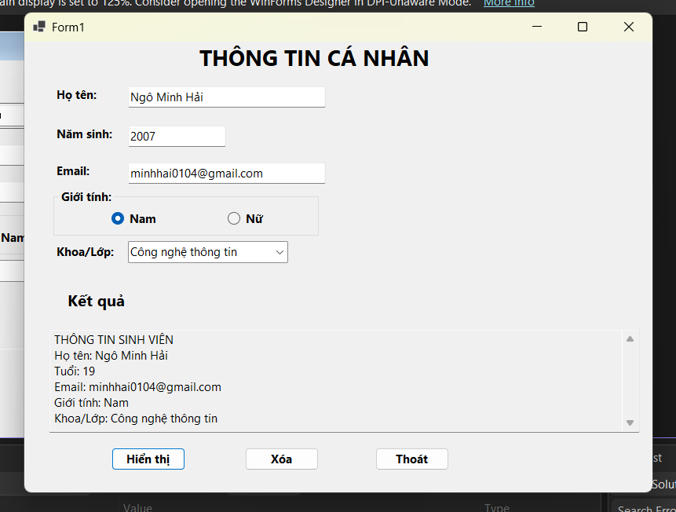
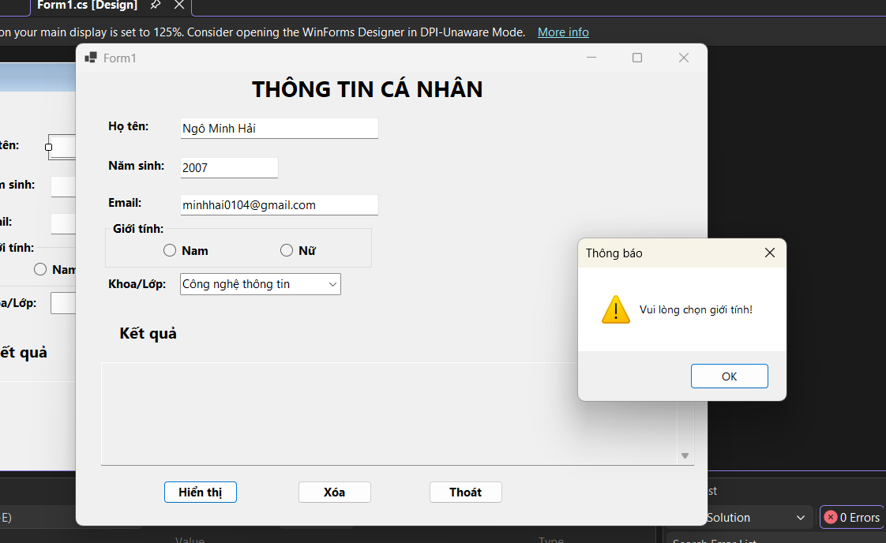
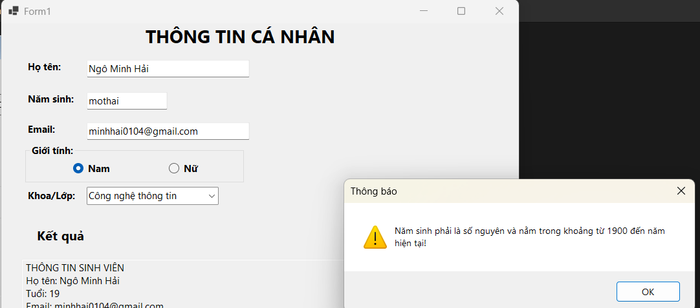
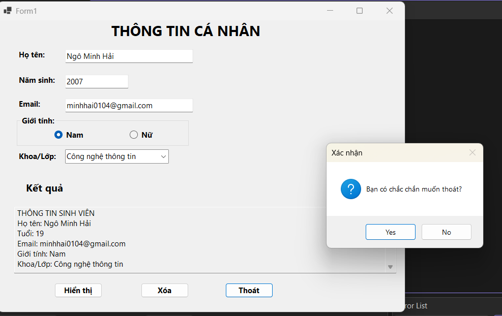

# BÀI LAB 01 - THÔNG TIN CÁ NHÂN

## 1. Mô tả
Ứng dụng Windows Forms nhập và hiển thị thông tin cá nhân của sinh viên, kiểm tra dữ liệu đầu vào.

## 2. Kết quả chạy chương trình

### Hiển thị thông tin thành công

### Lỗi chọn giới tính

### Lỗi năm sinh

### Xác nhận thoát

