# LAB 02: QUẢN LÝ MẢNG SỐ NGUYÊN BẰNG CONSOLE

- **Học phần:** COMP1019 - Lập trình trên Windows
- **Sinh viên thực hiện:** Ngô Minh Hải
- **Môi trường:** Visual Studio - C# Console App (.NET)

---

## 1. Mô tả chương trình
Chương trình Console quản lý mảng 1 chiều với các chức năng điều khiển qua Menu:
- Nhập mảng với kiểm tra số nguyên dương n (> 0).
- Xuất mảng, tính tổng mảng.
- Tìm giá trị lớn nhất (Max), nhỏ nhất (Min).
- Đếm số lượng phần tử chẵn, lẻ.
- Sắp xếp mảng theo thứ tự tăng dần.
- Tìm kiếm vị trí xuất hiện đầu tiên của giá trị x.
- Xử lý ngoại lệ: Chặn thao tác khi chưa nhập mảng, kiểm tra số âm, chống crash khi nhập sai lựa chọn.

---

## 2. Minh chứng kết quả kiểm thử (Test Cases)

### 2.1. Kiểm tra các trường hợp bẫy lỗi

- **Cảnh báo khi chưa nhập mảng:**

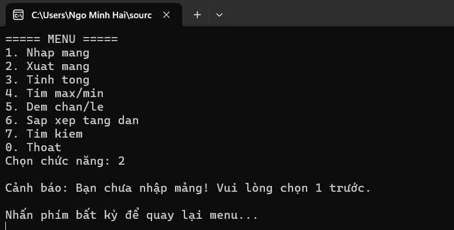

- **Kiểm tra số lượng phần tử n âm hoặc bằng 0:**

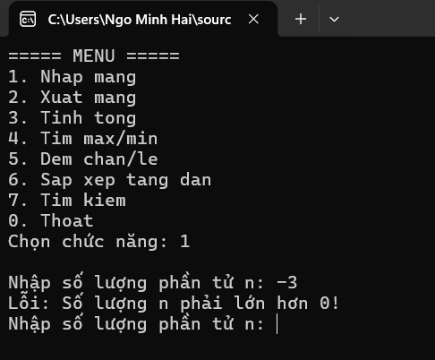

- **Kiểm tra nhập sai lựa chọn chức năng:**

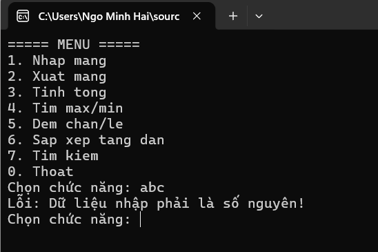

---

### 2.2. Dữ liệu thử nghiệm 5 phần tử: 4, 1, 9, 2, 7

- **Nhập và xuất mảng:**

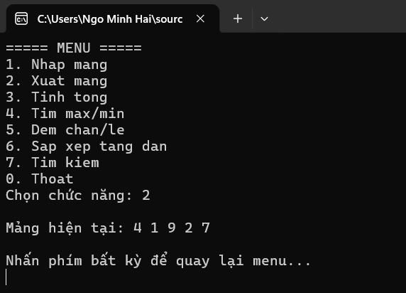

- **Tính tổng các phần tử (Tổng = 23):**

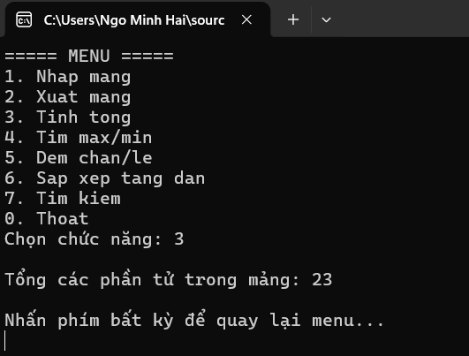

- **Tìm Max/Min (Max = 9, Min = 1):**

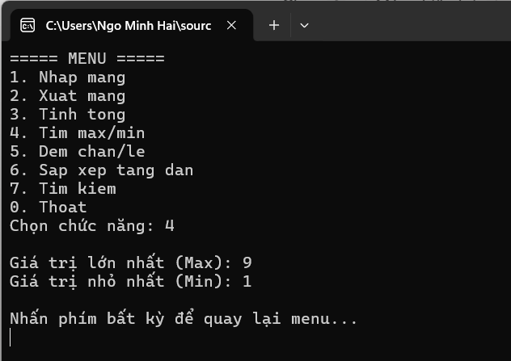

- **Đếm số lượng chẵn/lẻ (Chẵn = 2, Lẻ = 3):**

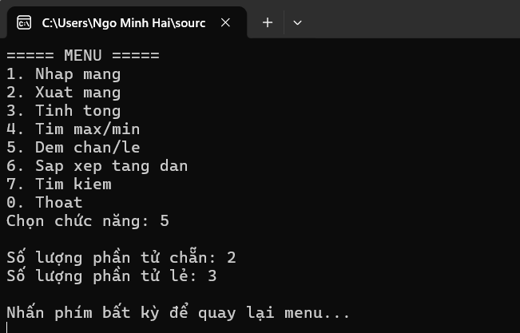

- **Sắp xếp mảng tăng dần (1 2 4 7 9):**

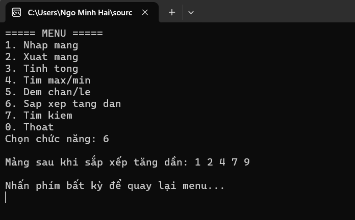

---

### 2.3. Kiểm thử chức năng tìm kiếm và thoát

- **Tìm x = 9 (Có tìm thấy):**

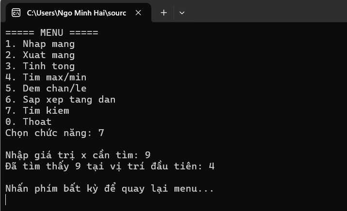

- **Tìm x = 5 (Không tìm thấy):**

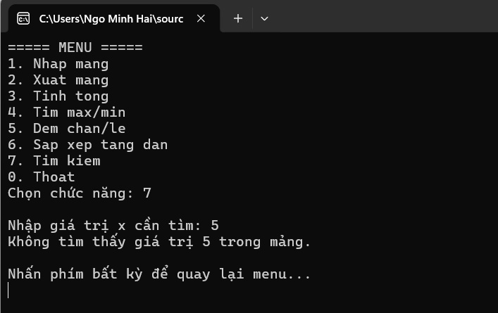

- **Thoát chương trình an toàn:**

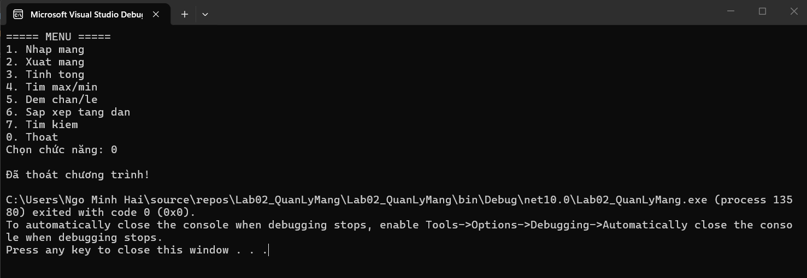
