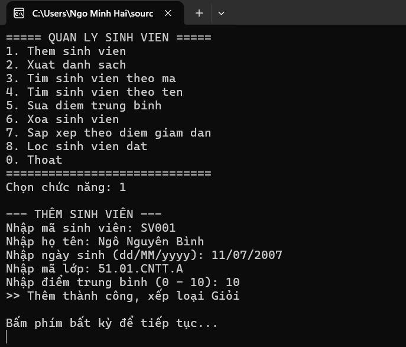
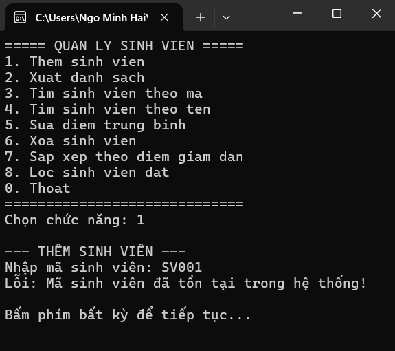
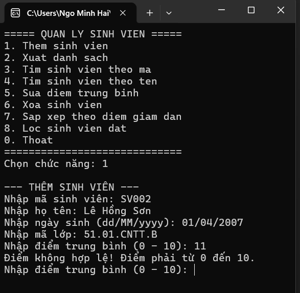
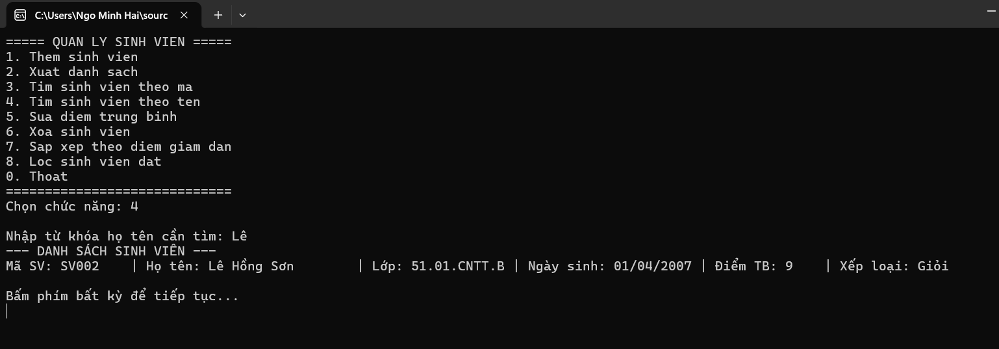
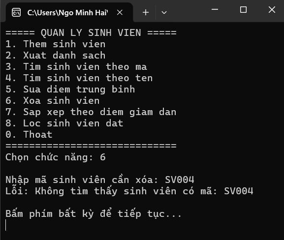
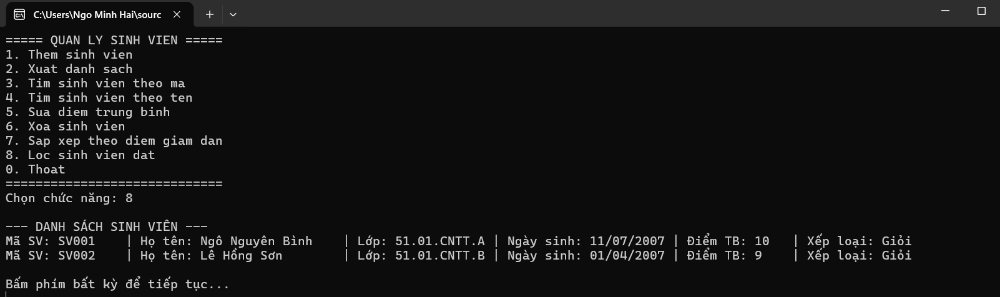

# BÁO CÁO THỰC HÀNH LAB 03
## CHỦ ĐỀ: C# VÀ LẬP TRÌNH HƯỚNG ĐỐI TƯỢNG - QUẢN LÝ SINH VIÊN BẰNG CONSOLE

* **Học phần:** 2611COMP101904-Lap-trinh-Windows
* **Sinh viên thực hiện:** Ngô Minh Hải
* **Môi trường phát triển:** Microsoft Visual Studio - C# Console App (.NET)
* **Kiến trúc mã nguồn:** Mô hình phân lớp đối tượng (OOP Architecture)

---

## 1. Mục tiêu và Kiến trúc hệ thống

Dự án hiện thực hóa bài toán quản lý danh mục sinh viên trong bộ nhớ động, bảo đảm áp dụng đầy đủ các nguyên lý cốt lõi của lập trình hướng đối tượng (OOP) và kỹ thuật truy vấn dữ liệu tích hợp (LINQ):

* **Tính kế thừa (Inheritance):** Thiết lập lớp cơ sở `Nguoi` đóng vai trò trừu tượng hóa các thực thể nhân sự cơ bản, lớp dẫn xuất `SinhVien` tái sử dụng và mở rộng các thuộc tính học vụ đặc thù thông qua cơ chế gọi hàm khởi tạo `base()`.
* **Tính đa hình (Polymorphism):** Định nghĩa phương thức ảo `virtual void LayThongTin()` tại lớp cha và thực hiện nạp đè `override` tại lớp con nhằm thực thi cơ chế dynamic binding trong quá trình hiển thị dữ liệu.
* **Tính đóng gói (Encapsulation):** Toàn bộ dữ liệu thành phần trong cấu trúc lớp được bảo vệ nghiêm ngặt. Thuộc tính `DiemTrungBinh` sử dụng accessors (`get`/`set`) để kiểm soát tính toàn vẹn miền giá trị $[0.0, 10.0]$.
* **Tách biệt tầng xử lý (Separation of Concerns):** Phân định ranh giới giữa tầng giao diện điều khiển (`Program.cs`) và tầng dịch vụ nghiệp vụ (`QuanLySinhVien.cs`), che giấu cấu trúc lưu trữ nội bộ `List<SinhVien>`.
* **Tối ưu hóa xử lý bằng LINQ:** Vận dụng các phương thức mở rộng như `.Where()`, `.OrderByDescending()`, `.FirstOrDefault()`, `.Any()` để hiện thực hóa các chức năng tìm kiếm, trích lọc và sắp xếp tập hợp dữ liệu.

---

## 2. Thực nghiệm và Đánh giá kết quả kiểm thử (Test Cases)

Dưới đây là kết quả kiểm thử các kịch bản biên và trường hợp xử lý ngoại lệ theo đặc tả kỹ thuật:

### 2.1. Thao tác thêm sinh viên và Phân loại học lực
Khởi tạo thành công đối tượng `SinhVien`, hệ thống tự động xác định xếp loại tương ứng theo thang điểm quy chuẩn:

### 2.2. Kiểm soát tính duy nhất của khóa chính (Primary Key Validation)
Hệ thống chặn trùng lặp mã sinh viên (`MaSinhVien`) trước khi cấp phát vào danh sách:

### 2.3. Ràng buộc toàn vẹn dữ liệu điểm số
Kiểm soát giá trị nhập liệu của trường điểm; từ chối các giá trị không thuộc miền $[0, 10]$ và yêu cầu tái nhập:

### 2.4. Truy vấn tìm kiếm đối tượng theo chuỗi ký tự (LINQ Filter)
Áp dụng LINQ kết hợp cơ chế so khớp không phân biệt hoa/thường để tra cứu sinh viên theo họ tên:

### 2.5. Xử lý ngoại lệ khi xóa thực thể không tồn tại
Kiểm tra sự hiện diện của phần tử trước khi thực hiện thao tác xóa khỏi bộ nhớ danh sách:

### 2.6. Trích lọc dữ liệu theo điều kiện nghiệp vụ (LINQ Expression)
Sử dụng toán tử lọc để trích xuất danh sách các sinh viên đạt điều kiện chuẩn đầu ra (điểm trung bình $\ge 5.0$):

