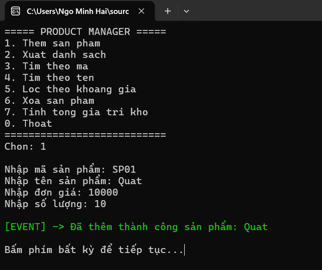
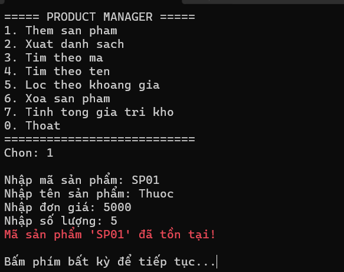
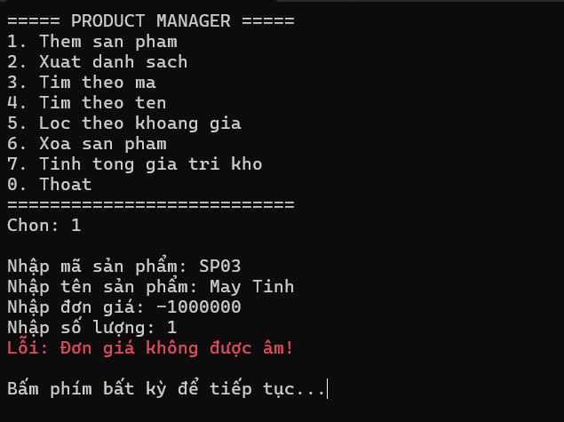
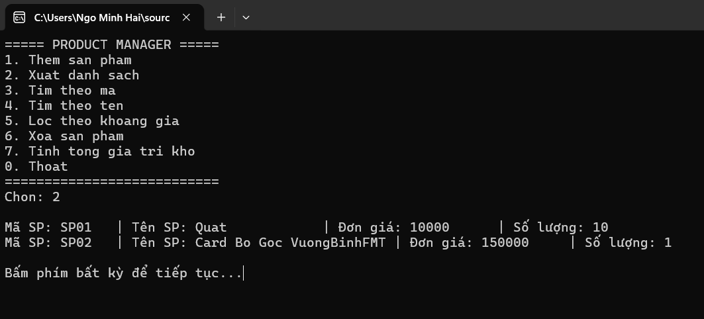
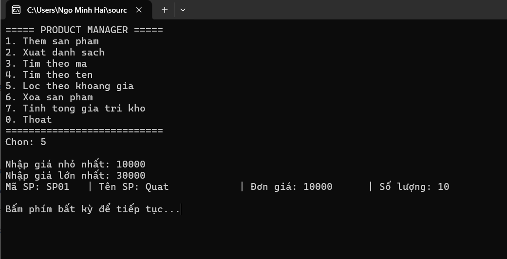
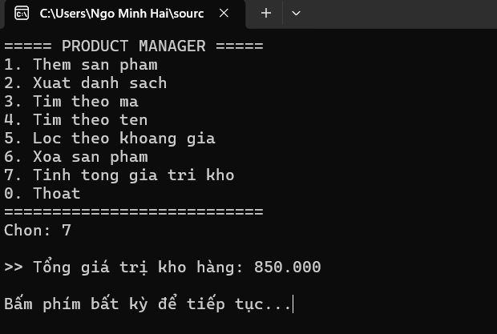
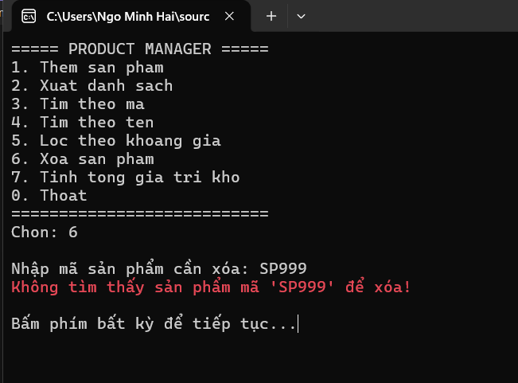

# BÁO CÁO THỰC HÀNH LAB 04
## CHỦ ĐỀ: XỬ LÝ NGOẠI LỆ, DELEGATE/EVENT, FUNC VÀ GENERIC TỔNG QUÁT

* **Học phần:** 2611COMP101904-Lap-trinh-Windows
* **Sinh viên thực hiện:** Ngô Minh Hải
* **Môi trường phát triển:** Microsoft Visual Studio - C# Console App (.NET)

---

## 1. Kiến trúc hệ thống và Kỹ thuật áp dụng

Dự án Quản lý Sản phẩm được thiết kế theo mô hình phân lớp, áp dụng các kỹ thuật lập trình C# nâng cao nhằm đảm bảo tính tái sử dụng, an toàn kiểu dữ liệu và toàn vẹn luồng thực thi:

* **Kho lưu trữ tổng quát (Generic Repository):** Xây dựng lớp `Repository<T>` với ràng buộc kiểu `where T : IEntity`. Cấu trúc này cho phép quản lý danh mục thực thể linh hoạt, tách biệt hoàn toàn thao tác CRUD khỏi logic nghiệp vụ.
* **Cơ chế hướng sự kiện (Action Event):** Tích hợp `event Action<Product>` và `event Action<string>` tại tầng `ProductService`. Cơ chế này cho phép phát tín hiệu (trigger) khi luồng dữ liệu thay đổi (Thêm/Xóa), giúp giao diện (`Program.cs`) tự động bắt tín hiệu và phản hồi màu sắc tương ứng.
* **Biểu thức Lambda và Func Delegate:** Vận dụng `Func<T, bool>` làm đối số (predicate) truyền vào hàm tra cứu của Repository, tối ưu hóa các thao tác lọc dải giá và tìm kiếm chuỗi không phân biệt hoa/thường.
* **Xử lý ngoại lệ tùy chỉnh (Custom Exceptions):** Định nghĩa các lớp ngoại lệ `DuplicateProductException` và `ProductNotFoundException` kế thừa từ `System.Exception`. Toàn bộ luồng giao tiếp (I/O) được bao bọc bởi cấu trúc `try-catch`, đảm bảo ứng dụng không bị gián đoạn (crash) trước các dữ liệu đầu vào dị thường.

---

## 2. Minh chứng kết quả kiểm thử (Test Cases)

Dưới đây là các kịch bản kiểm thử (Test Cases) xác thực khả năng bắt lỗi và xử lý sự kiện của hệ thống:

### 2.1. Thêm sản phẩm và Kích hoạt Event
Thêm mới sản phẩm thành công, hệ thống phát tín hiệu Event và phản hồi trạng thái hợp lệ trên giao diện:

### 2.2. Kiểm soát khóa chính (Primary Key Validation)
Bẫy lỗi `DuplicateProductException` khi cố tình cấp phát mã sản phẩm đã tồn tại trong bộ nhớ:

### 2.3. Ràng buộc toàn vẹn miền giá trị
Chặn dữ liệu đầu vào bất hợp pháp (giá trị âm) thông qua thuộc tính đóng gói (Encapsulation), ném ra `ArgumentException`:

### 2.4. Trích xuất danh mục tổng thể
Hiển thị toàn bộ các thực thể đang được quản lý trong Generic Repository:

### 2.5. Trích lọc dữ liệu qua Func Delegate
Sử dụng `Func<Product, bool>` để trích lọc tập hợp con các sản phẩm thỏa mãn điều kiện về biên độ giá:

### 2.6. Thống kê tổng quy mô dữ liệu
Áp dụng biểu thức LINQ `.Sum()` để tổng hợp giá trị lưu trữ (Đơn giá $\times$ Số lượng) theo thời gian thực:

### 2.7. Xử lý ngoại lệ khi thao tác với thực thể rỗng
Bẫy lỗi `ProductNotFoundException` và từ chối thực thi khi yêu cầu xóa một định danh không có thực trong hệ thống:

