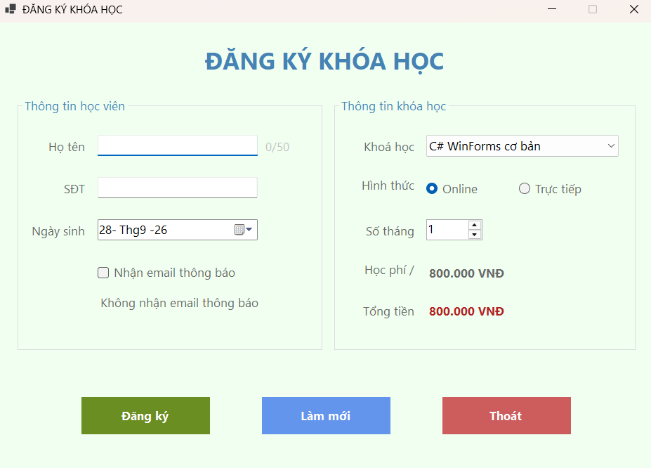
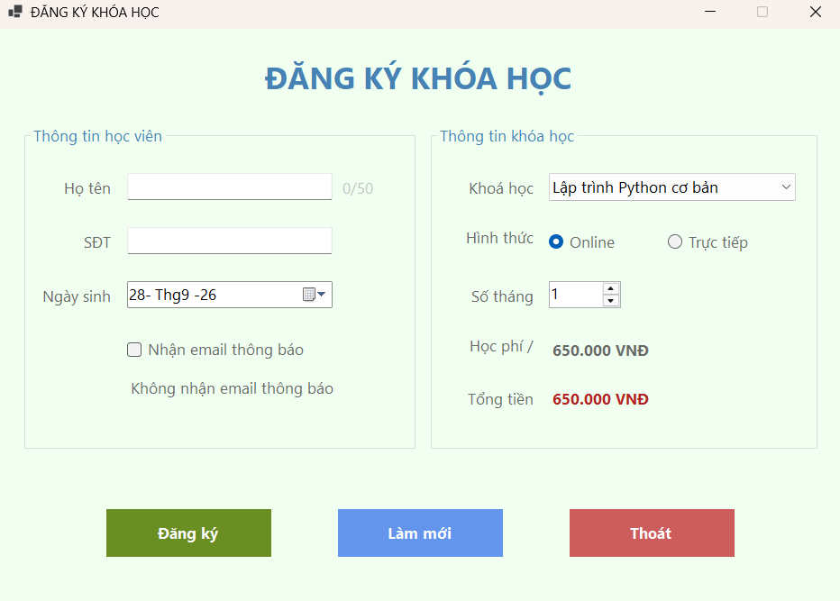
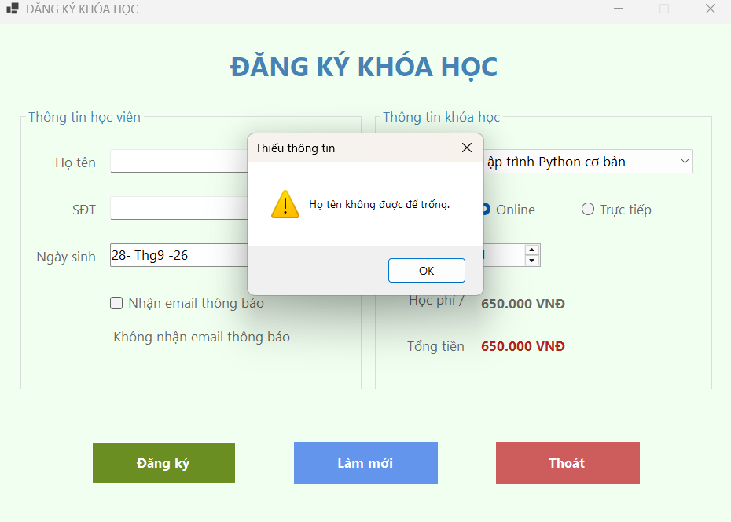
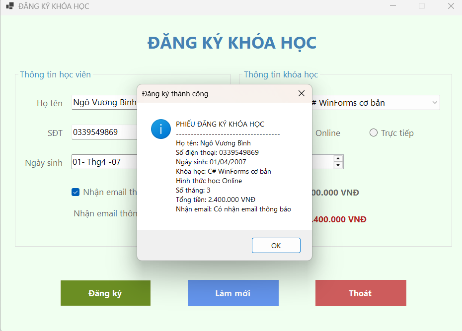
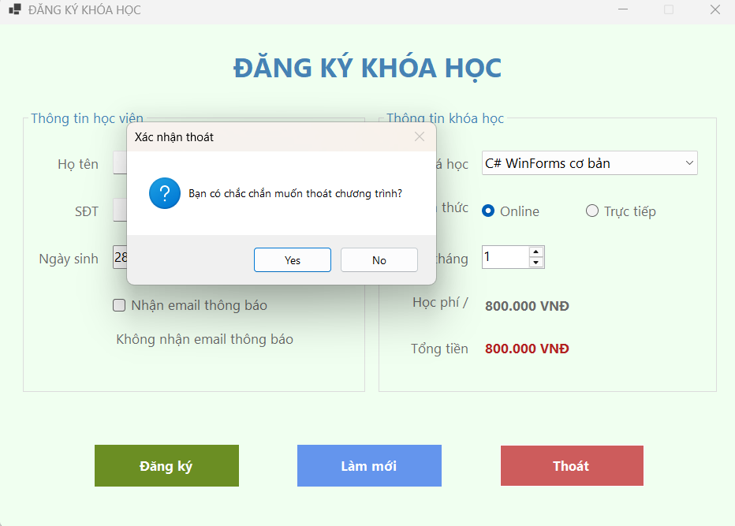

# BÁO CÁO THỰC HÀNH LAB 05
## HỌC PHẦN: LẬP TRÌNH TRÊN WINDOWS (COMP1019)
### CHỦ ĐỀ: XÂY DỰNG ỨNG DỤNG WINDOWS FORMS CƠ BẢN

* **Giảng viên hướng dẫn:** ThS. Lê Thanh Thoại
* **Sinh viên thực hiện:** Ngô Minh Hải
* **Môi trường phát triển:** Microsoft Visual Studio - C# Windows Forms App (.NET)
* **Tên ứng dụng:** CourseRegistrationApp

---

## 1. Giới thiệu và Mục tiêu kỹ thuật

Bài thực hành tập trung vào việc thiết kế giao diện đồ họa người dùng (GUI) và xử lý sự kiện tương tác theo mô hình hướng sự kiện (Event-Driven Programming) trên nền tảng Windows Forms:

* **Thiết kế giao diện chuẩn quy ước:** Phân tách bố cục logic bằng các vùng điều khiển (`GroupBox`), chuẩn hóa tiền tố định danh control (`txt`, `dtp`, `chk`, `cbo`, `rad`, `num`, `lbl`, `btn`) nhằm đảm bảo tính cấu trúc và khả năng bảo trì mã nguồn.
* **Cơ chế nạp và ràng buộc dữ liệu (Data Binding & Initialization):** Khởi tạo danh mục khóa học, thiết lập giá trị mặc định cho các thành phần điều khiển và tính toán học phí cơ sở ngay trong sự kiện `Form_Load`.
* **Xử lý sự kiện theo thời gian thực (Real-time Event Handling):** Lập trình cơ chế phản hồi tự động thông qua sự kiện `SelectedIndexChanged` của `ComboBox` và `ValueChanged` của `NumericUpDown` để cập nhật tổng chi phí học tập tức thời.
* **Kiểm soát tính toàn vẹn dữ liệu (Input Validation):** Kiểm tra tính hợp lệ của dữ liệu đầu vào (không bỏ trống các trường định danh như Họ tên, Số điện thoại) trước khi thực thi xử lý nghiệp vụ.
* **Xử lý luồng điều khiển và điều hướng (State Management & Navigation):** Đặt lại trạng thái ban đầu của Form thông qua nút "Làm mới" và thiết lập hộp thoại xác nhận hủy thao tác an toàn trước khi đóng ứng dụng.

---

## 2. Minh chứng thực nghiệm và Kiểm thử hệ thống (Test Cases)

Dưới đây là các minh chứng thực nghiệm xác thực việc hoàn thiện các yêu cầu chức năng theo chuẩn đánh giá Rubric:

### 2.1. Khởi tạo giao diện và nạp dữ liệu ban đầu
Hệ thống nạp danh mục khóa học vào `ComboBox`, kích hoạt mặc định khóa học đầu tiên, chọn hình thức Online và tự động tính toán tổng học phí ban đầu:

### 2.2. Tính toán học phí động theo thời gian thực
Cơ chế tự động tính toán và cập nhật lại `lblTongTien` khi người dùng thay đổi khóa học hoặc điều chỉnh số tháng đăng ký:

### 2.3. Kiểm tra ràng buộc dữ liệu nhập (Input Validation)
Hệ thống phát hiện lỗi và hiển thị cảnh báo khi các trường thông tin bắt buộc (Họ tên, Số điện thoại) bị bỏ trống:

### 2.4. Xác nhận đăng ký và xuất phiếu thông tin
Sau khi dữ liệu được xác thực hợp lệ, ứng dụng tổng hợp toàn bộ thông tin đăng ký và hiển thị phiếu xác nhận chi tiết qua hộp thoại `MessageBox`:

### 2.5. Xác nhận thoát ứng dụng an toàn
Hộp thoại xác nhận hiển thị nhằm ngăn chặn thao tác đóng ứng dụng đột ngột ngoài ý muốn của người dùng:

