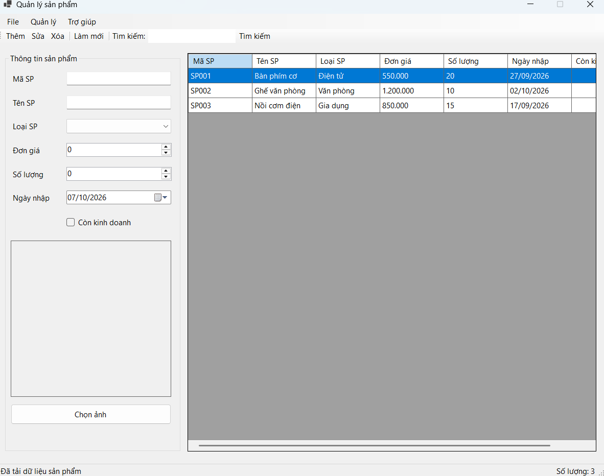
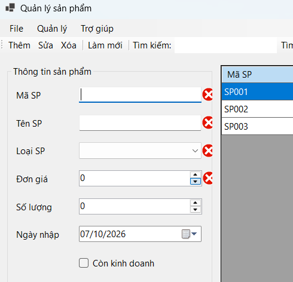
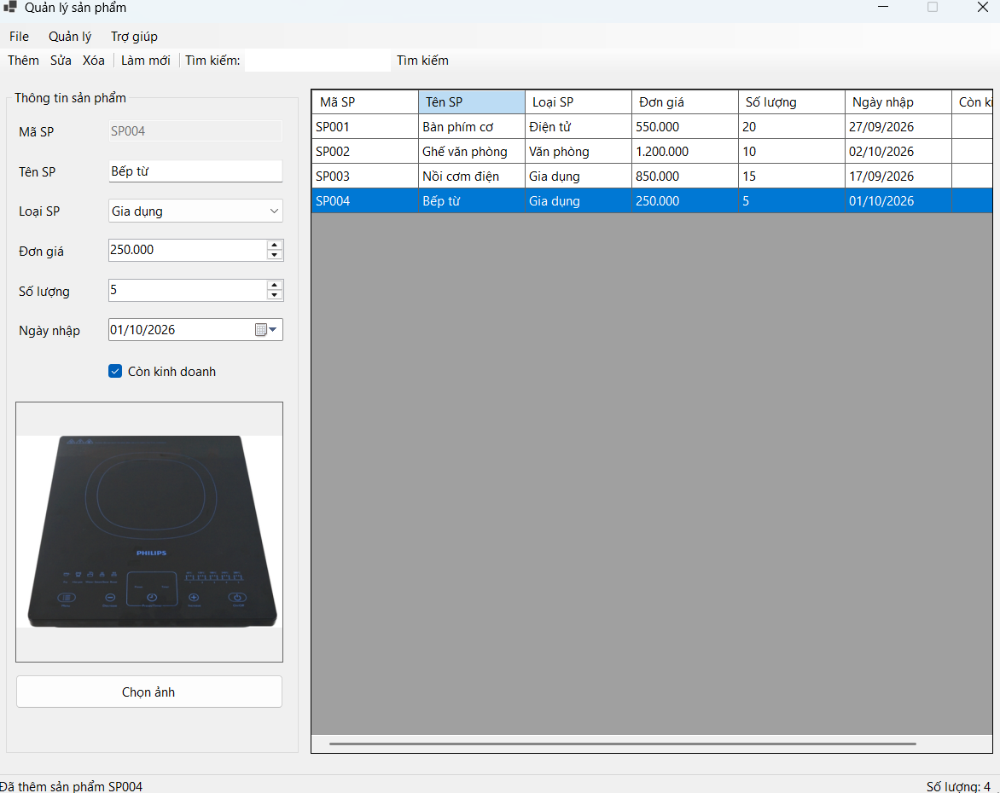
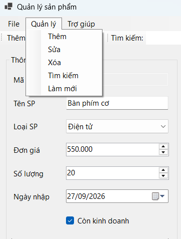
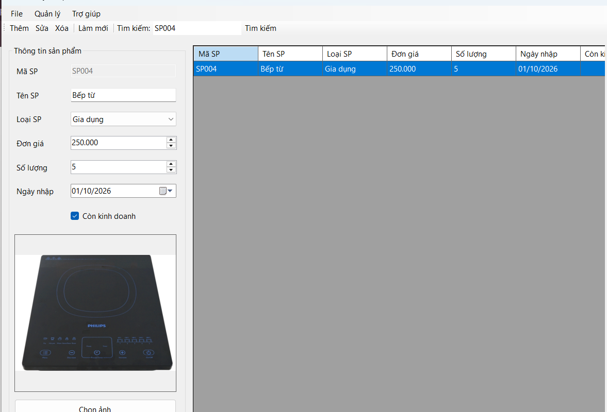
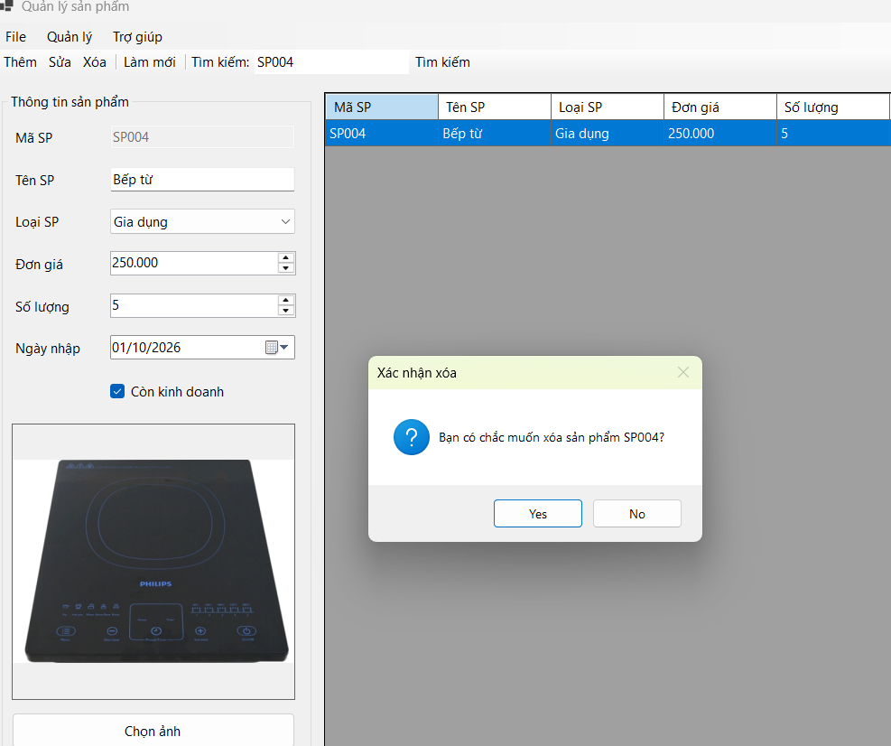
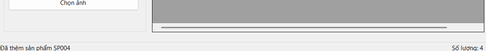

# BÁO CÁO THỰC HÀNH BUỔI 6: WINDOWS FORMS NÂNG CAO VÀ DATAGRIDVIEW

* **Học phần:** 2611COMP101904 - Lập trình trên Windows
* **Giảng viên hướng dẫn:** ThS. Lê Thanh Thoại
* **Sinh viên thực hiện:** Ngô Minh Hải
* **Môi trường phát triển:** Microsoft Visual Studio - C# Windows Forms App (.NET)
* **Tên ứng dụng:** ProductManager
* **Form chính:** FrmProduct (Tiêu đề: Quản lý sản phẩm)

---

## 1. Giới thiệu và Mục tiêu Kỹ thuật

Dự án `ProductManager` được thiết kế nhằm xây dựng giao diện quản lý thực thể chuẩn máy tính để bàn (Desktop Application), áp dụng các thành phần điều khiển nâng cao và cơ chế ràng buộc dữ liệu trực quan trên nền tảng .NET Windows Forms:

* **Kiến trúc Điều hướng Toàn diện:** Tích hợp hệ thống thanh điều hướng đa tầng gồm `MenuStrip` (các trình đơn File, Quản lý, Trợ giúp), `ToolStrip` thao tác nhanh các tác vụ CRUD và `StatusStrip` phản hồi trạng thái hoạt động cùng tổng số lượng bản ghi theo thời gian thực.
* **Ràng buộc và Đồng bộ Dữ liệu (Data Binding):** Quản lý tập hợp đối tượng bằng danh sách trong bộ nhớ kết hợp `BindingSource`, đảm bảo đồng bộ hai chiều liên tục với bảng hiển thị `DataGridView`.
* **Cấu hình Bảng Hiển thị Tối ưu:** Thiết lập `DataGridView` với các tham số chuẩn trải nghiệm người dùng (`ReadOnly = true`, `SelectionMode = FullRowSelect`, `MultiSelect = false`), ngăn chặn lỗi sửa trực tiếp trên ô và hạn chế ngoại lệ khi chưa chọn dòng.
* **Kiểm soát Toàn vẹn Dữ liệu Nhập (Input Validation):** Áp dụng `ErrorProvider` gắn cờ cảnh báo lỗi trực tiếp bên cạnh từng ô nhập liệu khi dữ liệu vi phạm quy tắc nghiệp vụ, kết hợp thông báo xác nhận `MessageBox` bảo vệ luồng thực thi.
* **Tương tác Nâng cao:** Triển khai menu ngữ cảnh `ContextMenuStrip` khi nhấp chuột phải trên bản ghi và tích hợp hộp thoại `OpenFileDialog` để nạp hình ảnh minh họa cho sản phẩm.

---

## 2. Đặc tả Cấu trúc Dữ liệu Sản phẩm (Class Product)

Lớp đối tượng `Product` được định nghĩa độc lập để lưu trữ và đóng gói toàn bộ thuộc tính của sản phẩm theo đặc tả kỹ thuật:

| Tên trường thuộc tính | Kiểu dữ liệu | Quy định ràng buộc nghiệp vụ |
| :--- | :--- | :--- |
| `MaSP` | `string` | Khóa chính xác định thực thể, không được để trống, không được trùng lặp. |
| `TenSP` | `string` | Tên gọi của sản phẩm, không được để trống. |
| `LoaiSP` | `string` | Phân loại lấy từ ComboBox (Điện tử, Văn phòng, Gia dụng, Thời trang). |
| `DonGia` | `decimal` | Đơn giá sản phẩm, bắt buộc giá trị $> 0$. |
| `SoLuong` | `int` | Số lượng tồn kho, bắt buộc giá trị $\ge 0$. |
| `NgayNhap` | `DateTime` | Ngày nhập hàng, ràng buộc không được lớn hơn ngày hiện tại (`DateTime.Today`). |
| `ConKinhDoanh` | `bool` | Trạng thái phân phối (True: Còn kinh doanh, False: Ngừng kinh doanh). |
| `DuongDanAnh` | `string` | Đường dẫn tuyệt đối của tệp hình ảnh lưu trữ cục bộ (cho phép rỗng). |

---

## 3. Quy ước Đặt tên Control và Thiết kế Hàm Xử lý

Nhằm đảm bảo tính chuẩn hóa mã nguồn, dự án áp dụng hệ thống tiền tố định danh control và phân tách các khối logic độc lập:

### 3.1. Danh mục Control
* `txtMaSP`: Ô nhập mã sản phẩm.
* `txtTenSP`: Ô nhập tên sản phẩm.
* `cboLoaiSP`: Hộp chọn phân loại danh mục sản phẩm.
* `numDonGia`: Ô chọn/nhập đơn giá sản phẩm.
* `numSoLuong`: Ô chọn/nhập số lượng tồn kho.
* `dtpNgayNhap`: Thành phần chọn ngày nhập hàng.
* `chkConKinhDoanh`: Hộp kiểm trạng thái kinh doanh.
* `picAnh`: Hộp hiển thị hình ảnh minh họa sản phẩm.
* `dgvProducts`: Bảng hiển thị danh mục sản phẩm.
* `lblStatus`: Nhãn hiển thị thông điệp và số lượng trên StatusStrip.
* `errProvider`: Đối tượng bẫy lỗi và hiển thị cảnh báo đỏ.

### 3.2. Phân rã Phương thức Nghiệp vụ
* `ValidateInput()`: Kiểm tra tính hợp lệ của toàn bộ dữ liệu trên giao diện và kích hoạt cờ lỗi nếu có vi phạm.
* `ClearInput()`: Đặt lại trạng thái ban đầu của các trường nhập liệu, xóa toàn bộ thông báo lỗi và đưa con trỏ về ô đầu tiên.
* `LoadProductToForm(Product sp)`: Đổ dữ liệu từ bản ghi đang chọn trên bảng hiển thị lên lại nhóm điều khiển nhập liệu.
* `UpdateStatus(string thongBao)`: Định dạng nội dung hiển thị trạng thái và cập nhật tổng số lượng bản ghi lên thanh `StatusStrip`.

---

## 4. Minh chứng Thực nghiệm và Kiểm thử Chức năng (Test Cases)

Hệ thống đã trải qua quá trình kiểm thử các kịch bản thao tác và ghi nhận kết quả thực nghiệm tương ứng với 7 hình ảnh minh chứng:

### 4.1. Khởi tạo Giao diện và Nạp Dữ liệu Mẫu (Load Form)
Giao diện khởi động với đầy đủ thanh công cụ, các trường nhập liệu được thiết lập mặc định và nạp sẵn dữ liệu mẫu lên bảng điều khiển:

### 4.2. Kiểm soát Tính Hợp lệ của Dữ liệu (Validation with ErrorProvider)
Hệ thống chặn thao tác và kích hoạt cảnh báo lỗi trực quan tại vị trí vi phạm khi người dùng để trống trường bắt buộc, nhập trùng mã hoặc sai định dạng:

### 4.3. Nạp Hình ảnh Minh họa bằng OpenFileDialog
Hộp thoại chọn tệp hệ thống cho phép người dùng định vị file ảnh từ đĩa cứng và nạp trực tiếp vào khung hiển thị ảnh:

### 4.4. Trình đơn Ngữ cảnh Nhanh (ContextMenuStrip)
Trình đơn thao tác nhanh hiển thị khi nhấp chuột phải vào dòng dữ liệu trên bảng, hỗ trợ gọi trực tiếp các lệnh Sửa, Xóa và Xem chi tiết:

### 4.5. Tra cứu và Trích lọc Bản ghi (Search Engine)
Bộ lọc tìm kiếm xử lý dữ liệu tương đối dựa trên Mã hoặc Tên sản phẩm, không phân biệt chữ hoa hay chữ thường:

### 4.6. Hộp thoại Xác thực Thao tác Hủy (Delete Confirmation)
Hệ thống bật hộp thoại thông báo xác nhận hai lựa chọn Yes/No nhằm ngăn ngừa việc xóa nhầm dữ liệu của người dùng:

### 4.7. Phản hồi và Cập nhật Trạng thái Hệ thống (StatusStrip Sync)
Thanh trạng thái dưới đáy màn hình lập tức cập nhật thông báo hoàn tất thao tác và hiển thị chính xác tổng số lượng sản phẩm tồn tại trong danh sách:

