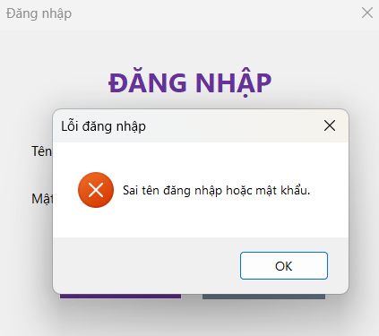
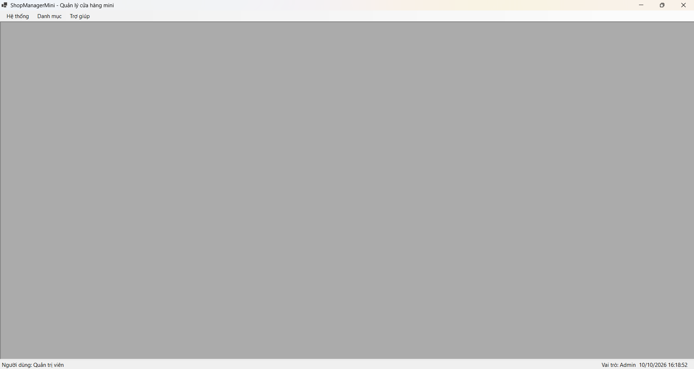
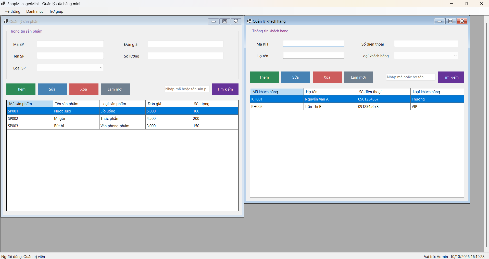
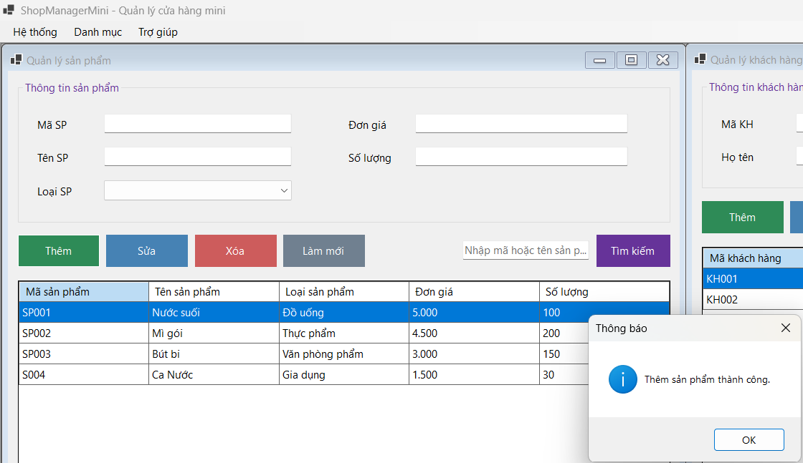
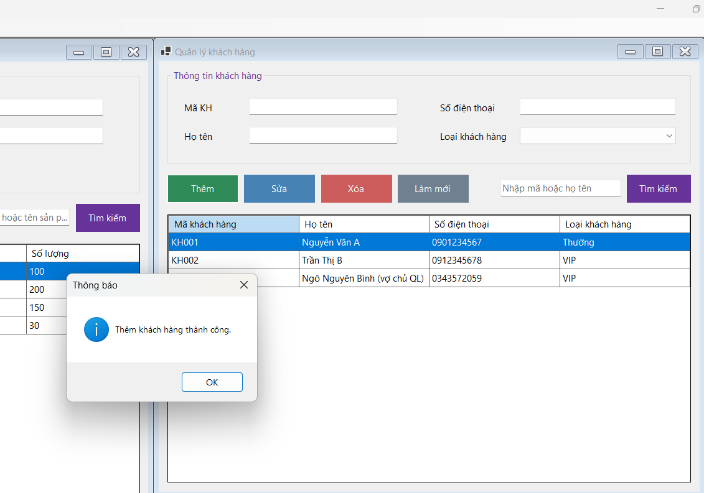
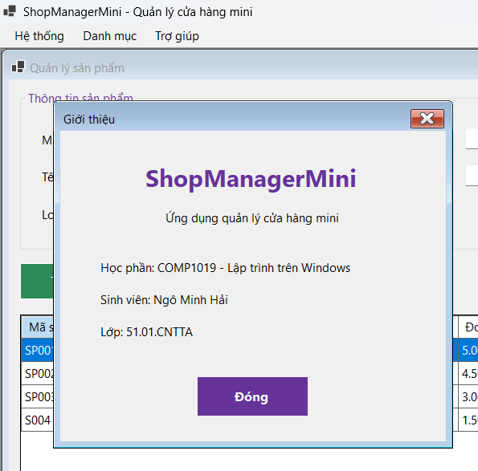
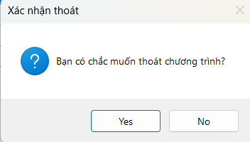

# BÁO CÁO THỰC HÀNH BUỔI 7: SDI, MDI VÀ ỨNG DỤNG NHIỀU FORM TRONG C# WINFORMS

* **Học phần:** 2611COMP101904 - Lập trình trên Windows
* **Giảng viên hướng dẫn:** ThS. Lê Thanh Thoại
* **Sinh viên thực hiện:** Ngô Minh Hải
* **Môi trường phát triển:** Microsoft Visual Studio - C# Windows Forms App
* **Tên ứng dụng:** ShopManagerMini

---

## 1. Giới thiệu và Kiến trúc Hệ thống

Dự án `ShopManagerMini` được xây dựng nhằm hiện thực hóa giải pháp quản lý cửa hàng mini nhiều Form, áp dụng kiến trúc đa tài liệu MDI (Multiple Document Interface) và luồng điều khiển hướng sự kiện:

* **Mô hình kiến trúc MDI Parent - Child:** `FrmMain` đóng vai trò là Form cha chứa (`IsMdiContainer = true`), quản lý vòng đời và không gian hiển thị của các Form con (`FrmProduct`, `FrmCustomer`, `FrmAbout`) bên trong vùng làm việc, ngăn chặn việc phân mảnh cửa sổ độc lập ngoài màn hình desktop.
* **Cơ chế xác thực và Điều phối luồng khởi động (Modal Authentication Flow):** Sử dụng `FrmLogin` chạy dưới dạng hộp thoại độc quyền (`ShowDialog()`). Dữ liệu người dùng được đóng gói trong đối tượng `User` và truyền sang Form chính `FrmMain` thông qua hàm khởi tạo (Constructor).
* **Quản lý Form con đơn lẻ (Singleton Child Navigation):** Kiểm tra tập hợp `this.MdiChildren` thông qua hàm `DaMoForm(Type)` nhằm kích hoạt (`Activate()`) lại thể hiện sẵn có thay vì khởi tạo trùng lặp khi người dùng chọn menu nhiều lần.
* **Lưu trữ dữ liệu trong bộ nhớ (In-Memory Data Binding):** Toàn bộ thực thể `User`, `Product`, `Customer` được quản lý bằng cấu trúc danh sách liên kết trong bộ nhớ và đồng bộ hiển thị lên `DataGridView`.

---

## 2. Đặc tả Danh mục Form và Chức năng

| Tên Form | Vai trò kiến trúc | Trách nhiệm chức năng chính |
| :--- | :--- | :--- |
| `FrmLogin` | Modal Form | Tiếp nhận xác thực tài khoản mẫu, bẫy lỗi nhập liệu, trả `DialogResult.OK` khi hợp lệ. |
| `FrmMain` | MDI Container | Form trung tâm chứa `MenuStrip`, `StatusStrip` hiển thị định danh/vai trò người dùng và quản lý Form con. |
| `FrmProduct` | MDI Child | Quản lý danh mục sản phẩm (Thêm, Sửa, Xóa, Tìm kiếm), hiển thị `DataGridView` và bẫy lỗi ràng buộc. |
| `FrmCustomer` | MDI Child | Quản lý danh sách khách hàng, hiển thị bảng thông tin đối tác và thêm mới dữ liệu. |
| `FrmAbout` | Child Form | Hiển thị thông tin bản quyền ứng dụng, thông tin sinh viên thực hiện và lớp học phần. |

---

## 3. Minh chứng Thực nghiệm và Kiểm thử Hệ thống (Test Cases)

Dưới đây là các minh chứng thực nghiệm tương ứng với các tiêu chí trong Rubric đánh giá:

### 3.1. Xác thực Đầu vào và Bẫy lỗi Đăng nhập
Kiểm tra tính hợp lệ của tài khoản mẫu, kích hoạt hộp thoại thông báo cảnh báo khi bỏ trống hoặc nhập sai thông tin xác thực:

### 3.2. Đăng nhập Thành công và Điều phối Dữ liệu Người dùng
Đăng nhập thành công với tài khoản quản trị/nhân viên, điều hướng vào `FrmMain` và hiển thị chính xác tên người dùng cùng vai trò trên thanh `StatusStrip`:

### 3.3. Quản lý Không gian MDI Container
Khởi tạo và quản lý đồng thời các Form nghiệp vụ con bên trong vùng làm việc của `FrmMain`, không mở thành các cửa sổ rời rạc:

### 3.4. Quản lý Danh mục Sản phẩm trên DataGridView
Giao diện quản lý danh mục sản phẩm thực hiện kiểm soát ràng buộc dữ liệu, hiển thị danh sách trực quan trên bảng `DataGridView`:

### 3.5. Thực thi Thao tác Thêm Bản ghi Dữ liệu
Thực hiện nhập liệu thông tin mới và cập nhật thành công bản ghi vào bộ nhớ hệ thống:

### 3.6. Thông tin Bản quyền và Định danh Sinh viên
Màn hình `FrmAbout` hiển thị đầy đủ thông tin hệ thống, xác thực định danh sinh viên thực hiện dự án:

### 3.7. Hộp thoại Xác nhận An toàn (Confirmation Dialog)
Cơ chế bảo vệ dữ liệu với hộp thoại xác nhận lựa chọn trước khi thực thi thao tác xóa thực thể hoặc thoát chương trình:

---

## Câu hỏi nộp kèm

**1. SDI và MDI khác nhau như thế nào?**
SDI: mỗi Form độc lập, đóng/mở riêng, không nằm trong Form khác. MDI: có một Form cha (`IsMdiContainer = true`) chứa nhiều Form con bên trong vùng làm việc; đóng Form cha thì các Form con đóng theo.

**2. Vì sao Form đăng nhập nên dùng ShowDialog()?**
`ShowDialog()` mở Form dạng modal: chương trình dừng lại cho đến khi đăng nhập xong, người dùng không thao tác được chỗ khác. Kết quả trả về `DialogResult` để `Program.cs` biết đăng nhập thành công (`OK`) hay thoát (`Cancel`).

**3. Dữ liệu user được truyền từ FrmLogin sang FrmMain bằng cách nào?**
`FrmLogin` có property `NguoiDung` (kiểu `User`), gán khi đăng nhập đúng. Sau `ShowDialog()` trả `OK`, `Program.cs` lấy `frmLogin.NguoiDung` và truyền vào constructor `new FrmMain(frmLogin.NguoiDung, ...)`. `FrmMain` dùng để hiển thị tên và vai trò trên StatusStrip.

**4. Bấm menu sản phẩm nhiều lần thì xử lý thế nào để không mở trùng Form?**
Hàm `DaMoForm(Type)` trong `FrmMain` duyệt `MdiChildren`; nếu đã có Form cùng loại thì `Activate()` Form đó và thoát, chỉ khi chưa có mới tạo Form mới, gán `MdiParent = this` rồi `Show()`.

**5. Khi nào dùng constructor, khi nào dùng property để truyền dữ liệu giữa các Form?**
Constructor: dữ liệu bắt buộc phải có ngay khi Form được tạo (ví dụ `FrmMain` cần user, `FrmProduct` cần danh sách sản phẩm). Property: dữ liệu có sau khi Form đã chạy hoặc cần lấy ngược về Form gọi (ví dụ `FrmLogin.NguoiDung` chỉ có giá trị sau khi người dùng đăng nhập).